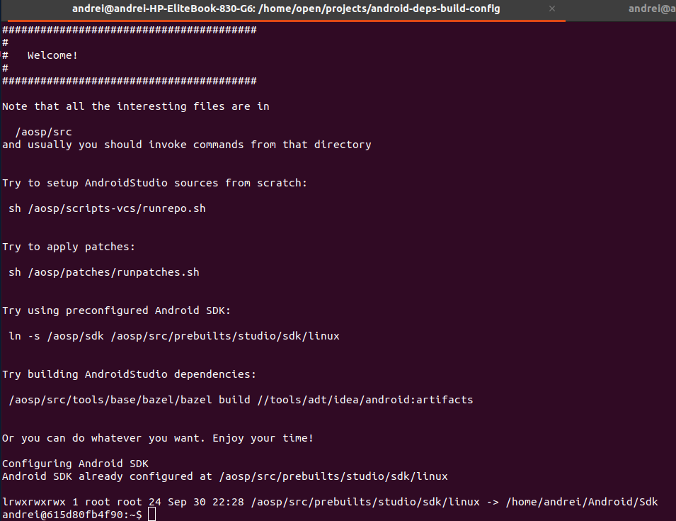
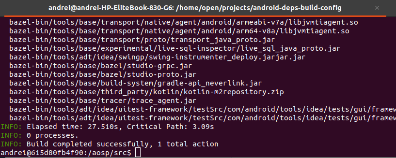

[](https://confluence.jetbrains.com/display/ALL/JetBrains+on+GitHub)

# Third-Party Licences
By building this docker image you confirm that you accept Google's Android SDK and Android NDK licenses (https://developer.android.com/studio/terms).

# Prerequisites
* Linux machine (other OS also probably fine, but some tuning might be needed)
* At least 50 GB free disk space
* Latest and greatest Docker (18.0 or newer)

# Step-by-step guide (for Linux)

1. Clone this repository, and navigate inside the checked out directory
2. Setup `AOSP_ROOT` environment variable. If you have AOSP sources downloaded - you can use them. Otherwise just create 
   an empty folder and make `AOSP_ROOT` pointing to it. We will download sources later.
```
export AOSP_ROOT=</path/to/parent/of/"tools"/dir, or empty dir>
```
3. Run the script
```
sh ./rundevmode.sh
```
1. it will build docker image
2. it will start docker container and will make a 3-4 folders shared between the docker and the host 
   (e.g. `$AOSP_ROOT`, `~/.cache/bazel`, `~/.cache/.m2` and ``~/.cache/.gradle``)



Now when we have docker container up and running, all the following commands should be executed inside Docker (not inside the host):
1. `$AOSP_ROOT` is now mounted to `/aosp/src` inside the container. If `$AOSP_ROOT` was pointing to an empty directory,
   this is good time to download the sources. Sources will be downloaded to `/aosp/src` inside the container, and will be available at
   `$AOSP_ROOT` on the host.
```
cd /aosp/src && sh /aosp/builder/scripts-vcs/runrepo.sh
```
2. Apply patches to the sources otherwise they won't compile
```
cd /aosp/src && sh /aosp/builder/patches/runpatches.sh
```
3. Build Android Studio dependencies with bazel
```
cd /aosp/src && /aosp/src/tools/base/bazel/bazel build //tools/adt/idea/android:artifacts
```



Now go back to the host, open `$AOSP_ROOT/tools/adt/idea` in IDEA and click `rebuild project`
* Make sure to set the `SDK_PLATFORM` Path Variable to `linux/android-studio` (https://cs.android.com/android-studio/platform/tools/adt/idea/+/mirror-goog-studio-main:studio/README.md)
* Use `Android Studio` run configuration to run Android Studio from sources.


# Understanding the guide

Google builds Android Studio with Bazel (Blaze). They have a huge monorepo which contains a lot of sources and binaries.
Some parts of this monorepo are visible from https://android.googlesource.com/, others are private. To checkout sources
special tool is needed - `repo`. Sources contain not only Java/Koltin code, but also native C/C++ code, and one needs
Android SDK and Android NDK to build it properly.

The solution is as follows: sources are shared between the host and docker container. Sources can be loaded to IDEA on
the host, but there are a few JARs which should be generated by Bazel. In order to build them we create Docker container
and run Bazel there.

Sources are [downloaded with a repo tool](https://android.googlesource.com/platform/tools/base/+/studio-master-dev/source.md#doing-a-checkout).
Docker container has a copy of `repo` inside. `repo` is smart enough to ignore unreachable repositories. Usually it is
safe to ignore warnings that some remote repository is not found.

Sources from AOSP are built with Bazel. Original Bazel files reference some other files from private repositories.
Patches (`runpatches.sh`) are removing these dependencies. Additionally, patches are removing private modules (e.g. `google-appindexing`)
from `modules.xml`, which do not compile anyway.

Sharing the files between the Docker and the Host is yet another challenging task. Files on the host are owned by `$USERNAME`.
which has its own `id` and `gid`. As part of the container setup `dev-local/setuplocaluser.sh`
is executed that creates a user inside the docker. If you have problems with permissions on files - this is the first
place to check.
